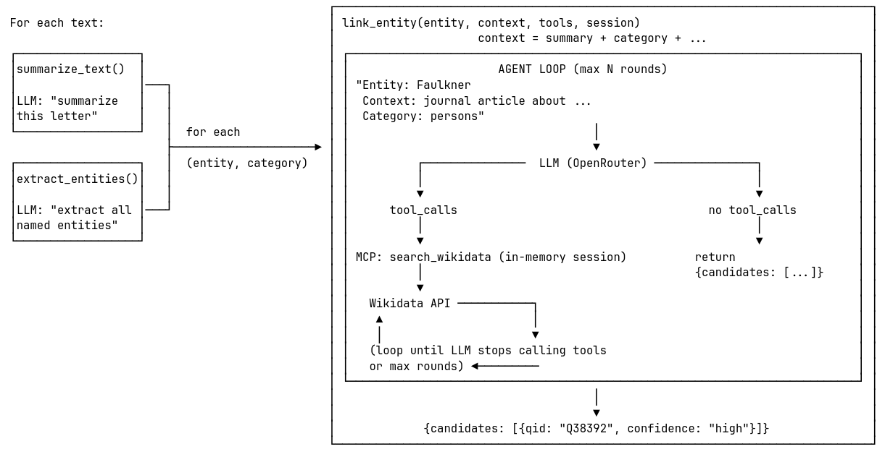
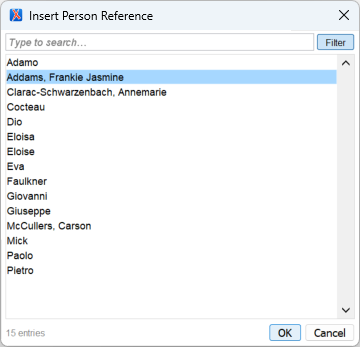
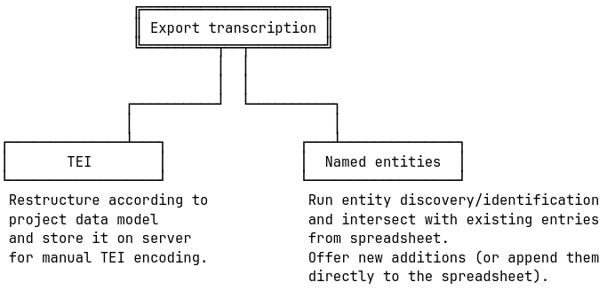
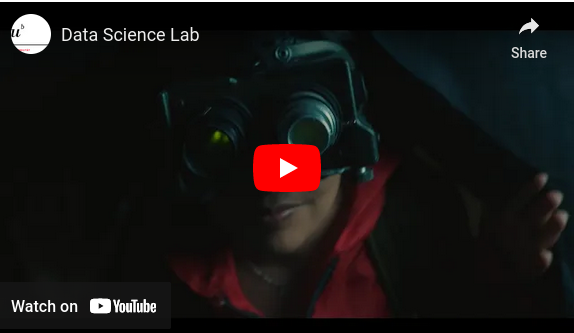

<!-- column_layout: [1,7,2,1] -->
<!-- column: 0 -->


<!-- column: 1 -->

Edition workflow: General approach
===

<!-- column: 3 -->
<!-- new_lines: 34 -->


<!-- column: 1 -->

<!-- new_lines: 3 -->

<!-- pause -->
# Corpus definition
<!-- new_line -->
<!-- pause -->
# Image digitisation (Swiss National Library)
<!-- new_line -->
<!-- pause -->
# IIIF upload
<!-- new_line -->
<!-- pause -->
# Transkribus (raw transcriptions)
<!-- pause -->
## Generation of IIIF manifests (as sequences of canvasses/images per document)
<!-- pause -->
## IIIF manifest-based upload to Transkribus
<!-- pause -->
## Transcription (primarily automated for print/typescripts, manual for manuscripts)
<!-- pause -->
## Document export (incl. transformation to project data structure)
<!-- new_line -->
<!-- pause -->
# Transcription and annotation in oXygen XML editor (with project framework)
<!-- new_line -->
<!-- pause -->
# Web app development (SvelteKit, CETEIcean)
<!-- end_slide -->


<!-- column_layout: [1,7,2,1] -->
<!-- column: 0 -->


<!-- column: 1 -->

Edition workflow: General approach
===

<!-- column: 3 -->
<!-- new_lines: 34 -->


<!-- column: 1 -->

<!-- new_lines: 3 -->

# Corpus definition
<!-- new_line -->
# Image digitisation (Swiss National Library)
<!-- new_line -->
# IIIF upload
<!-- new_line -->
# Transkribus (raw transcriptions)
## Generation of IIIF manifests (as sequences of canvasses/images per document)
## IIIF manifest-based upload to Transkribus
## Transcription (primarily automated for print/typescripts, manual for manuscripts)
## <span style="color: #d6002b;">Document export (incl. transformation to project data structure)</span>
<!-- new_line -->
# <span style="color: #d6002b">Transcription and annotation in oXygen XML editor (with project framework)</span>
<!-- new_line -->
# Web app development (SvelteKit, CETEIcean)

<!-- column: 2 -->
<!-- new_lines: 24 -->

```
Named entity detection and 
identification
```


<!-- end_slide -->

<!-- column_layout: [1,7,2,1] -->
<!-- column: 0 -->


<!-- column: 1 -->

Edition workflow: Named entities
===

<!-- column: 3 -->
<!-- new_lines: 34 -->


<!-- column: 1 -->

<!-- new_lines: 5 -->

Goal: facilitate **manual tagging** by creating an **automatically compiled list** with possible entries (including authority references)

Approach: 

* use an <span style="color: #d6002b">LLM</span> to evaluate the raw Transkribus output of each transcribed document and 
* <span style="color: #d6002b">detect entities</span>, 
* try to <span style="color: #d6002b">link them to one or more authority records</span>, and
* deduplicate the resulting list
* in order to offer the entries in the <span style="color: #d6002b">linking utility in oXygen</span>

We call this a "**proto index**", an imperfect index of entities that likely occur in the corpus. 

It is meant to be a shortcut for the editors that saves them manual querying of authority databases.

The actual entity tagging is done by the editors.

<!-- new_line -->
*State of work: experimental, explorative (but not too far from production-ready)*

<!-- end_slide -->


<!-- column_layout: [1,4,1,4,1] -->
<!-- column: 0 -->


<!-- column: 1 -->

Demo
===

<!-- new_line -->

# Step 1

**Feed documents to <span style="color: #d6002b">LLM</span> and ask to <span style="color: #d6002b">detect entities</span>, then <span style="color: #d6002b">identify</span> them using Wikidata knowledge.**

*Using a slim local helper service that acts like a plug‑in the model can call (via the Model Context Protocol, a simple way for tools to talk to each other).*

*This allows to search (e.g.) Wikidata directly (quickly, in memory) without extra servers or manual wiring.*

<!-- column: 3 -->

<!-- new_lines: 5 -->

# Step 2

**Take output of step 1 and <span style="color: #d6002b">enrich it with Wikidata information</span>, then generate a <span style="color: #d6002b">spreadsheet (csv)</span>.**

*Simple Python pipeline executing SPARQL queries (no LLM used).*

<!-- column: 4 -->
<!-- new_lines: 34 -->


<!-- end_slide -->

Demo
===

# Step 1



<!-- end_slide -->

Demo
===

# Step 1

Feed documents to LLM and ask to detect entities, then identify them using Wikidata knowledge.

```py {6-12 | 16-19}
ENTITY_CLASSES = [
    "persons", "places", "institutions", "publishers", "works", "events", "citations"
]

ENTITY_SEARCH_SYSTEM_PROMPT = f"""
You are a semantic annotation assistant for a Digital Humanities project working with historical writings (Italian).
Your task: read the text below and extract ALL named entities you can find, grouped by category.
Return a JSON object with the following top-level keys, each mapping to an array of exact surface forms as they appear in the text:
{json.dumps({category: [] for category in ENTITY_CLASSES}, indent=2)}
Rules:
- Use the exact string as it appears in the source text (do not normalize or modernize)
- If a category has no entries, return an empty array
"""

ENTITY_LINKING_SYSTEM_PROMPT = """
You are an entity linking assistant for a Digital Humanities project working with historical writings (Italian).
Your task: link the given entity to a knowledge base (e.g. Wikidata) using the provided context for disambiguation.
Return a JSON object with a 'candidates' key containing a list of matches, each with a 'qid' and a 'confidence' of high, medium, or low. If no candidates are found, return an empty list.
"""

TEXT_SUMMARIZATION_SYSTEM_PROMPT = """
You are a summarization assistant for a Digital Humanities project working with historical writings (Italian). 
Your task is to produce a concise summary of the given text, capturing the main topics and context that could help with entity disambiguation.
The summary should be no more than 2-3 sentences long and should focus on the key information relevant for understanding the entities mentioned in the text.
"""
```

<!-- end_slide -->

```bash
/// cd demo/step1 && rm -rf .venv && python3 -m venv .venv && source .venv/bin/activate && pip install --upgrade pip
pip install -r requirements.txt
python main.py > output.txt
```

For executed code see: https://asciinema.org/a/CvUyVktwWlx02NTE?t=43
===

<!-- end_slide -->

```bash
/// cd demo/step2 && python3 -m venv .venv && source .venv/bin/activate && pip install --upgrade pip
pip install -r requirements.txt
python -m main --input ../../demo/step1/output.txt --output entities_enriched.csv --log pipeline.log
```

For executed code see: https://asciinema.org/a/CvUyVktwWlx02NTE?t=165
===

<!-- end_slide -->

```bash
csvlens demo/step2/entities_enriched.csv
  
```

For executed code see: https://asciinema.org/a/CvUyVktwWlx02NTE?t=194
===

<!-- end_slide -->

<!-- column_layout: [1,4,5,1] -->
<!-- column: 0 -->


<!-- column: 3 -->
<!-- new_lines: 34 -->


<!-- column: 1 -->

<!-- new_line -->

# **Result: facilitated manual tagging based the automatically compiled list**

The generated entries are used to populate the entity spreadsheet(s) of the project (with manual checks).

The oXygen framework queries the spreadsheet and offers the entities for comfortable linking.

<!-- new_lines: 4 -->

---

<!-- new_line -->

# **Next steps and further considerations**

## Workflow decisions

We need to define in what frequency and with what degree of automation this recognition/identification task is executed.

One idea is to integrate it into the Transkribus document export. In part, this depends on how fixed the decisions around named entities are (and with them the structure of the spreadsheet).

## Topic identification

The pipeline (step 1) could also be used to relate documents to topics (as an alternative to topic modelling or manual identification).

<!-- column: 2 -->



---


 
<!-- end_slide -->

<!-- column_layout: [1,9,1] -->
<!-- column: 0 -->


<!-- column: 2 -->
<!-- new_lines: 34 -->


<!-- column: 1 -->

Technical partner of the Arcipelago Ceresa project
===


Data Science Lab -- https://dsl.unibe.ch
===

 

 

https://youtu.be/afXUHAUZ4dk
===
